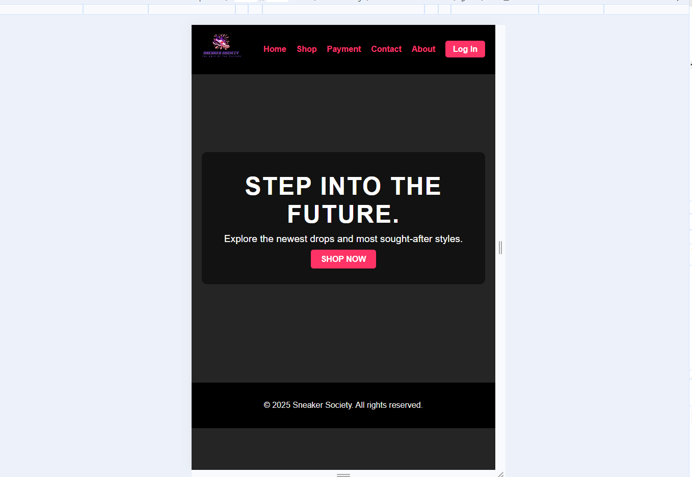
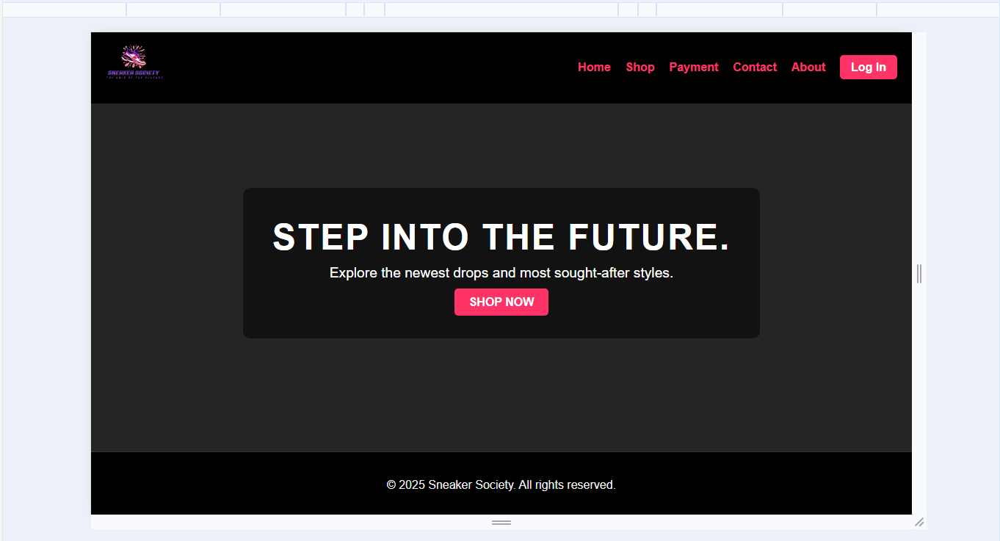
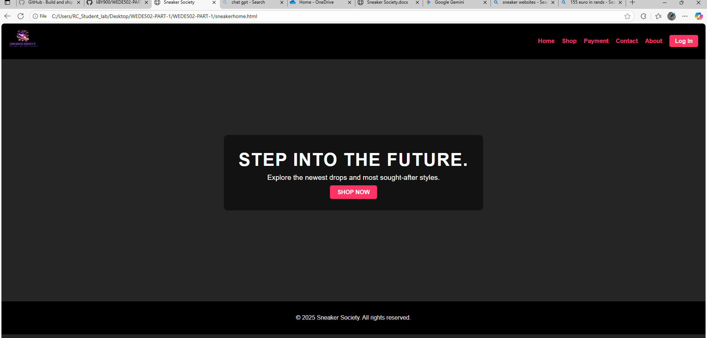
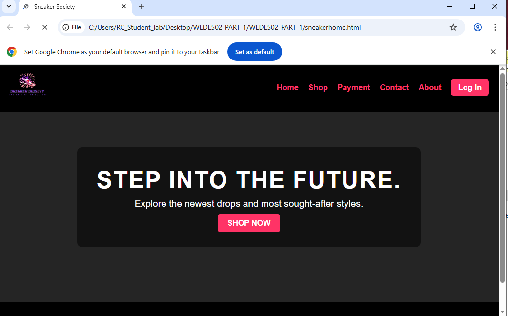
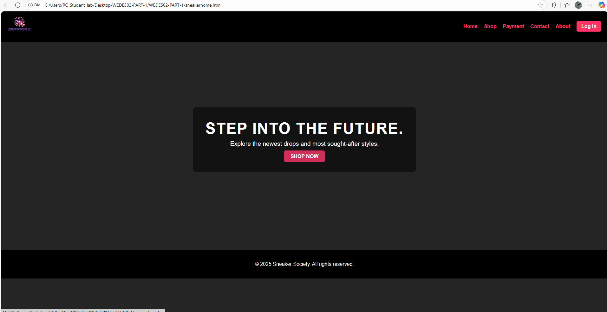

# Project Title
# The Sneaker Shop

## Student Information 
# Liberty Kambanje
# ST10465691

## Project Overview
The Sneaker Society project is an e-commerce website designed to be a premier destination for sneaker enthusiasts. The site will showcase a curated collection of rare and vintage sneakers, aiming to attract a target audience of sneakerheads, collectors, and fashion-forward individuals aged 16–35. The website's core purpose is to sell products while also building a strong brand identity and community around sneaker culture. The design will be sleek and modern, prioritizing high-quality product images and a seamless user experience.

## Website Goals and Objectives
Goals:

Sell Products: Create a visually appealing e-commerce platform that drives sales of sneakers.
Build a Brand: Establish Sneaker Society as a trustworthy and authoritative source for sneakers, fostering a community of enthusiasts.
Increase Website Traffic: Drive traffic through engaging content and effective search engine optimization (SEO) strategies.

## Key Performance Indicators (KPIs):

Sales Conversion Rate: The percentage of website visitors who make a purchase.
Average Order Value (AOV): The average amount of money spent per transaction.
Website Traffic: The number of unique visitors, with a focus on traffic from targeted keywords and social media.
Social Media Engagement: The level of interaction (shares, comments, likes) with website content on social media platforms.

## Key Features and Functionality

Home Page: A dynamic landing page with a prominent hero banner showcasing new releases and popular products.
Shop Page: A comprehensive online store with filtering options for brand, size, color, and style. Each product page will include detailed descriptions, a size chart, and multiple high-resolution images.
Payment Details: A secure form for users to enter credit card information (card number, cardholder name, expiry date, CVV) with a "Pay Now" button to submit the transaction.
Order Summary: A clear breakdown of costs, including the price of the item(s), a shipping fee, and the final total.
About Us Page: A concise overview of the company's origin story, philosophy, and team.
Contact Page: A page with the company's location, hours of operation, a map, and a contact form.

## Timeline and Milestones

START DATE : 20 August 2025
Submission Date : 7 September 2025

Project Planning : 21 August 2025
Content Gathering : 23 August 2025
HTML Structure and filr setup : 26 August 2025
Website Navigation : 27 August 2025
Testing Website : 30 August
Final Submission : 4 September

## SiteMap 

Homepage >>> sneakerhome
ShopPage >>> sneakershop
PaymentPage >>> sneakerpayment
ContactPage >>> sneakercontact
AboutPage >>> sneakerabout

## Change Log: 2025

August 20, 2025: Project Kick-off

August 21, 2025: Project Planning

August 23, 2025: Content Gathering
Initial content for all key pages, such as product descriptions, company history, and contact information, was gathered.

August 26, 2025: HTML Structure and File Setup
The foundational HTML structure for the website set up.
Initial project files and folders will be organized in the local repository.

August 27, 2025: Website Navigation
The website navigation system will be implemented, linking all main pages as defined in the sitemap (Homepage, ShopPage, PaymentPage, ContactPage, and AboutPage).

August 30, 2025: Website Testing
Initial testing of the website's functionality began. The focus will be on ensuring that all navigation links worked correctly and that the basic page structures loaded without errors.

September 4, 2025: Final Submission
The project will be prepared for final submission, including a review of all implemented features and a final check for any bugs or errors.

# GITHUB link : https://github.com/liBY900/WEDE502-PART-1.git

# Part 2 #

The Sneaker Shop 

This repository contains the code for a multi-page website for "Sneaker Society" a community focused on selling vintage and rare sneakers. The website is designed to be informative, user-friendly, and responsive across various devices. 

# Features # 

Multi-Page Structure: The website is organized into multiple HTML files (sneakerhome.html, sneakerabout.html, sneakerpayment.html, sneakershop.html, sneakercontact.html). 

External Stylesheet: All styling is managed in internal and an external ccs file. 

Responsive Design: The layout, typography, and visual assets are precisely engineered for a seamless and consistent viewing experience across all modern devices (desktop, tablet, and mobile) through the strategic use of CSS Flexbox, CSS Grid, and comprehensive media queries. 

Clear Navigation: A sticky header with clear navigation links and call-to-action buttons ensures users can easily find the information they need. 

Modern UI/UX: The design incorporates soft colors, rounded corners, and subtle hover effects to create an engaging and professional aesthetic. 

Changelog 

This changelog documents the updates made to the website code from Part 1 to Part 2, based on the provided feedback and requirements. 

# Visuals, Styling, and Responsive Design # 

Date: September 23, 2025 

Description of Changes: 

External Stylesheet Creation: Created a new, central stylesheet named style.css. 
HTML Refactoring: Removed all inline <style> blocks from all existing HTML files. 

Stylesheet Linking: Linked every HTML page to the new style.css file using the <link> tag in the <head> section. 

Base Styling: Added a CSS reset and established base styles for the entire website, including a consistent font family (Helvetica Neue", Arial, sans-serif 

), font sizes (rem units), and a color palette using CSS variables (--primary-color, etc.). 

For the whole website we styled it using external styling and for different page styling we used internal .

Typography: Applied typography styles with font-family, font-size, font-weight, and line-height for h1 through h6 and p tags. 

Layout Structure: Implemented Flexbox and CSS Grid for layout on key pages, such as the navigation bar and program grid, to ensure a robust and flexible design. 

Visual Styling: Applied decorative styles using background-color, box-shadow, and border-radius. Added pseudo-classes like :hover to interactive elements to improve user experience. 

Responsive Design Implementation: Built a fully responsive interface using @media queries (tablet and mobile breakpoints) and relative units (em, rem, vw) to ensure font sizes and layouts scale correctly, successfully switching complex views to a single-column display on smaller screens. 

# Page Refinement #  

Date: September 23, 2025 

Description of Changes: 

Corrected Stylesheet Path: Updated the stylesheet link from style.css to style.css for cross-browser compatibility. 

Replaced Local Image: The local image path (c:\Users\RC_Student_lab\...) was replaced with a valid, publicly accessible placeholder image URL ("https://via.placeholder.com/1500x800/111/f0f0f0?text=New+Releases+Banner"). 

Corrected HTML Structure: The HTML was refactored to use the correct classes and structure from the main stylesheet, ensuring a consistent and responsive design across the site. 

# Programs Page Fixes and Improvements # 

Date: September 24, 2025 

Description of Changes: 

Corrected Stylesheet Path: The stylesheet link was corrected from style.css to style.css for proper file linking. 

Replaced Local Images: All local image file paths were replaced with publicly accessible placeholder image URLs to ensure images display correctly for all users. 

 The styling for images and the program grid layout was moved to the central style.css file to adhere to best practices. 

# Added Images on the website #

Date: September 24,2025

Description of Changes: 
 Added images for the shopping webpage and About page for the images of the team , and link the styling of the grids from style.css

 

# Added a Login page # 

Date: September 25, 2025 

 

Description of Changes: 

 Implemented a Secure User Authentication System: Developed a dedicated   login page to enable users to access their personalized accounts, enhancing platform functionality. The page was seamlessly integrated with the existing site architecture, utilizing the global  brand background color for a consistent and professional user experience. This feature is a foundational step for personalized content and account security. 

 

Core Styling and Color Palette Implementation 

A bold, high-contrast, and modern color scheme was defined to elevate the website's aesthetic and brand identity. This implementation ensures a visually striking and consistent user experience. 

Header & Footer: Set to a solid black background for a strong, unified frame. Header text uses Neon Pink for navigation and emphasis. 

Base Body: The main content area uses a dark grey background with white text to ensure readability and a sleek, premium look. 

Call-to-Action (CTA) Buttons: Primary buttons are styled with a Neon Pink background and white text to maximize visibility and drive conversions. 

CSS Variables: (Implied improvement) Color values are stored as CSS variables (e.g., --primary-black, --accent-pink) for easy maintenance and global consistency.

# Website Color Scheme Update #

Header: Background color – Black | Text color – Neon Pink

Body: Background color – Dark Grey | Text color – White

Buttons: Background color – Neon Pink | Text color – White

Footer: Background color – Black | Text color – White

# ScreenShot #

Mobile

Crop

Tablet
 
 
Desktop

On Chrome

On Microsoft Edge

# New Change log #

Added Enquiry Page (enquiry.html)

Date: November 10, 2025
Description of Changes:

Created enquiry.html to allow users to enquire about services, products, volunteering, or sponsorship opportunities.
Added HTML form elements with proper input validation for name, email, message and selection fields.
Implemented client-side JavaScript validation to ensure accurate form submission.
Integrated AJAX form submission for seamless user experience.
Differentiated form functionality from contact.html, focusing on enquiry-specific interactions such as availability, cost or service details.

JavaScript Enhancements

Date: November 14, 2025
Description of Changes:

Added a JavaScript file "Script.js" for enhancing factionality .
Integrated search functionality to filter and sort content across pages.
Added CSS and JavaScript animations/transitions for improved UX.
Developed advanced DOM manipulation for dynamic page interactions.
Implemented interactive maps using Leaflet/Mapbox/Google Maps API (for location-based features).

SEO Improvements

Date: November 16, 2025
Description of Changes:

On-Page SEO:

Conducted keyword research and applied keywords to content.
Added compelling title tags, meta descriptions, and structured headings (H1-H3).
Optimized image file names and alt text.
Ensured clean, descriptive URL structure and internal linking.
Verified mobile-friendliness.

Off-Page SEO:
Built high-quality backlinks.
Applied local SEO strategies.
Additional Requests:

Optimized page loading speed.

Implemented security measures for website protection.
Form Functionality and Validation

Date: November 18, 2025
Description of Changes:

Added validated HTML forms to enquiry.html and contact.html.
Ensured proper input types and attributes for user-friendly data collection.
Implemented JavaScript-based client-side validation and error handling.
Enabled AJAX submission for asynchronous data processing.
Differentiated forms: enquiry.html focuses on service/product enquiries; contact.html collects general messages for the organization.

 

# Reference # 

HTML codes > W3Schools.com, https://www.w3schools.com/html/default.asp.

Images > An inside look at the world of Ultra-Rare sneakers 2022, https://www.sothebys.com/en/articles/an-inside-look-at-the-world-of-ultra-rare-sneakers.

Enquiry form > Formspree. (2025). https://formspree.io/forms/mvgdnzeg/overview

Maps > Textomap | Turn text into interactive maps in seconds. (2025). https://www.textomap.com/

CSS styling > SuperSimpleDev 2022, HTML & CSS Full course - Beginner to Pro, YouTube, https://www.youtube.com/watch?v=G3e-cpL7ofc.

Colors > HTML color codes, https://htmlcolorcodes.com/.

 
